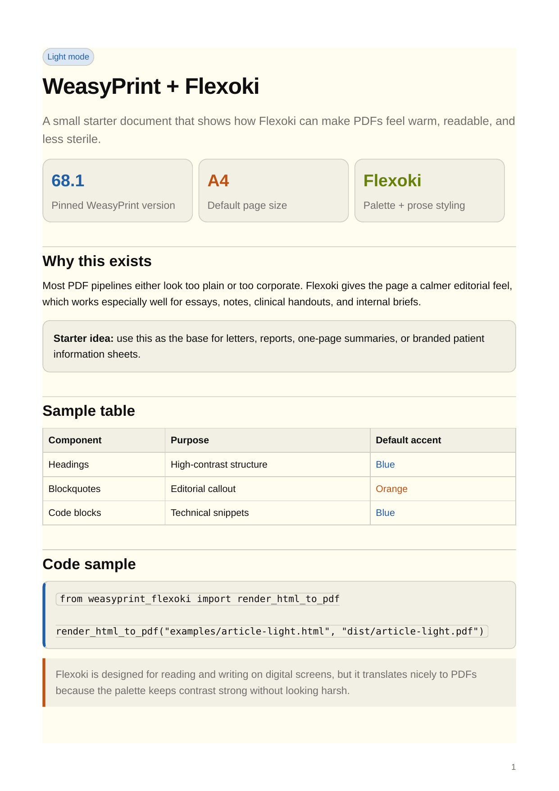

# weasyprint-flexoki

A small toolkit for generating beautiful PDFs with **WeasyPrint 68.1** and the **Flexoki** palette.

It gives you a cleaner default than a plain HTML-to-PDF pipeline, while staying simple enough to use for real work: letters, reports, briefs, handouts, and other prose-heavy documents.

## Why this exists

WeasyPrint is excellent at rendering HTML to PDF, but the default result can feel a little bare. Flexoki gives the output a warmer, calmer, more editorial look without making it fussy.

The result is a PDF style that feels:
- readable
- print-friendly
- softer than a typical corporate document
- structured enough for professional use

## Preview



## Features

- **WeasyPrint pinned to 68.1**
- **Flexoki-inspired PDF stylesheet**
- **HTML to PDF** rendering
- **Markdown to PDF** rendering
- **Jinja template support** for reusable documents
- built-in example templates for **letters** and **reports**
- sample **clinical brief** Markdown document
- auto-generated **GitHub trending magazine** example
- screen-first **magazine-style HTML demo** with horizontal pagination
- print/export **magazine PDF** path built with WeasyPrint
- GitHub Actions workflow that renders examples on push and pull request

## Supported input types

You can render:

- `.html`
- `.md`
- `.html.j2` with a JSON context file

## Installation

```bash
python -m venv .venv
source .venv/bin/activate
pip install -e .
```

## CLI usage

### HTML

```bash
weasyprint-flexoki examples/article-light.html dist/article-light.pdf
weasyprint-flexoki examples/article-dark.html dist/article-dark.pdf
```

### Markdown

```bash
weasyprint-flexoki examples/clinical-brief.md dist/clinical-brief.pdf
```

Use `--theme` and `--title` for Markdown documents:

```bash
weasyprint-flexoki \
  examples/clinical-brief.md \
  dist/clinical-brief-dark.pdf \
  --theme dark \
  --title "Clinical Brief"
```

### Jinja templates

Render a template with JSON context:

```bash
weasyprint-flexoki \
  src/weasyprint_flexoki/templates/letter.html.j2 \
  dist/letter.pdf \
  --context examples/letter-context.json

weasyprint-flexoki \
  src/weasyprint_flexoki/templates/report.html.j2 \
  dist/report.pdf \
  --context examples/report-context.json
```

## Python API

```python
from weasyprint_flexoki import render_document_to_pdf

render_document_to_pdf("examples/article-light.html", "dist/article-light.pdf")
render_document_to_pdf("examples/clinical-brief.md", "dist/clinical-brief.pdf")
render_document_to_pdf(
    "src/weasyprint_flexoki/templates/report.html.j2",
    "dist/report.pdf",
    context_path="examples/report-context.json",
)
```

## Included examples

### HTML examples
- `examples/article-light.html`
- `examples/article-dark.html`
- `examples/github-trending-magazine.html` (interactive weekly issue)
- `examples/github-trending-magazine-print.html` (print/export version)

### Generated data snapshot
- `examples/github-trending-magazine-data.json`

### Markdown example
- `examples/clinical-brief.md`

### Jinja templates
- `src/weasyprint_flexoki/templates/letter.html.j2`
- `src/weasyprint_flexoki/templates/report.html.j2`
- `src/weasyprint_flexoki/templates/github-trending-magazine-screen.html.j2`
- `src/weasyprint_flexoki/templates/github-trending-magazine-print.html.j2`

### Example context files
- `examples/letter-context.json`
- `examples/report-context.json`

## Project structure

```text
weasyprint-flexoki/
├── .github/workflows/
│   └── render-examples.yml
├── assets/
│   └── preview-light.png
├── examples/
│   ├── article-dark.html
│   ├── article-light.html
│   ├── clinical-brief.md
│   ├── github-trending-magazine-data.json
│   ├── github-trending-magazine-print.html
│   ├── github-trending-magazine.html
│   ├── letter-context.json
│   ├── report-context.json
│   └── template-render-demo.md
├── scripts/
│   └── generate_github_trending_magazine.py
├── src/weasyprint_flexoki/
│   ├── cli.py
│   ├── flexoki.css
│   ├── render.py
│   └── templates/
│       ├── github-trending-magazine-print.html.j2
│       ├── github-trending-magazine-screen.html.j2
│       ├── letter.html.j2
│       └── report.html.j2
└── pyproject.toml
```

## Styling notes

This project uses the **Flexoki** palette and naming conventions from the upstream Flexoki project by Steph Ango, adapted here for PDF-first document rendering.

- Upstream repo: https://github.com/kepano/flexoki
- Project page: https://stephango.com/flexoki
- Upstream license: MIT

This repo does **not** bundle the entire Flexoki repository. It includes a focused stylesheet built for WeasyPrint output.

## Typical use cases

This setup works especially well for:

- internal memos
- essays and long-form notes
- clinical briefs
- one-page handouts
- formal letters
- compact summary reports
- branded academic or medical PDFs
- editorial HTML presentations and magazine-style browsing demos

## GitHub trending magazine

Regenerate the weekly issue, the print/export HTML, the data snapshot, and the PDF in one step:

```bash
python scripts/generate_github_trending_magazine.py \
  --period week \
  --screen-output examples/github-trending-magazine.html \
  --print-output examples/github-trending-magazine-print.html \
  --data-output examples/github-trending-magazine-data.json \
  --pdf-output dist/github-trending-magazine-weekly.pdf
```

What it does:
- fetches live GitHub trending repos for the selected window
- defaults to a **weekly** issue
- keeps the interactive HTML magazine and the print/export HTML in sync
- writes a JSON snapshot of the issue data
- renders a PDF export through WeasyPrint

If GitHub returns fewer than 12 repos for the weekly feed, the generator tops up the final slot from the daily feed so the 14-page issue structure stays intact.

## GitHub Actions

The included workflow:

- regenerates the weekly GitHub trending magazine assets
- renders the example PDFs automatically on push to `main`
- runs on pull requests
- supports manual workflow dispatch

Rendered PDFs are uploaded as workflow artifacts.

## Roadmap

Possible next additions:

- frontmatter support for Markdown metadata
- branded template packs
- cover-page and footer presets
- release workflow for packaged builds

## License

MIT
